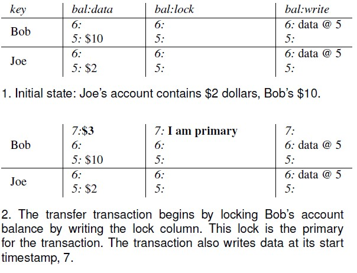

# Percolator

> Percolator为谷歌用来处理WEB索引库增量更新的系统。在对WEB索引建库时，倘若要对新增的WEB文档添加索引，因为该WEB页面可能有大量对其他的页面的引用与被引用，为了处理这些复杂的关系， 要么把所有涉及到的相关网页全部重新计算，要么就需要保存下所有WEB文档的中间处理结果，由于这些处理结果存在者并发的实时更新，因此，需要一个支持分布式事务的数据处理引擎，来保证数据的更新正确性。

### 架构

* Percolator构建于Bigtable之上，它使得本来仅支持单行事务的Bigtable能够支持分布式的跨行事务。他为每个Bigtable的tablet server提供了观察者，每当观测到Tablet中的数据改变时，就启动新的事务进行后续工作，并且将结果写回Bigtable。Percolator利用Bigtable的单行事务的特性，为每一份数据设计了三个列，lock， data， write。具体实现在后面解释。

### API

```c++

bool UpdateDocument(Document doc) {
    Transaction t(&cluster);
    t.Set(doc.url(), "contents", "document", doc.contents());
    int hash = Hash(doc.contents());
    string canonical;
    if (!t.Get(hash, "canonical-url", "dups", &canonical)) {
        t.Set(hash, "canonical-url", "dups", doc.url());
    }
    return t.Commit();
}

```

### 实现分析

* Percolator的数据存储格式如下:



> 初始时，Bob的账户上有10美元，数据内容记在data这一列；write这一列则记录了该行当前的数据版本。接下来，Bob发生了一笔转账，现在账户数据变成了3美元。

> 该事务T执行时，会先往lock这一列写入带当前时间戳的锁primary，然后写入当前时间戳的最新数据，但此时旧的数据10美元并没有被覆盖，如果另外一个并发事务G访问该Tablet，只要G的时间戳小于T的时间戳，那么他就不会查到锁primary，也不会查到未提交的数据3美元。当T提交时，会将write这一列记录的最新版本从data@5变更为data@7, 这样之后的事务就可以查到该次更改了。

* Percolator的客户端Commit实现伪代码如下:

```c++
class Transaction {
    struct Write { Row row; Column col; string value; };
    vector<Write> writes_;
    int start_ts_;
    Transaction() {
        // 获取事务开始的时间戳
        start_ts_ = orcale.GetTimestamp();
    }
    void Set(Write w) {
        writes_.push_back(w);
    }
    void Get(Row row, Column c, string *value) {
        while (true) {
            bigtable::Txn T = bigtable::StartRowTransaction(row);
            // 检查发生在事务T之前的未提交的事务，倘若存在写冲突， 则尝试回滚该次读事务，并重新执行
            if (T.Read(row, c+"lock", [0, start_ts])) {
                BackoffAndMaybeCleanupLock(row, c);
                continue;
            }
            // 查找该行数据的在事务开始前的最近一个版本，如果没有找到则表示该行还未写入过数据
            last_write = T.Read(row, c+"write", [0, start_ts_]);
            if (!latest_write.found()) {
                return false;
            }
            // 拿到该行的最新版本后，去data列下取出对应的数据
            int data_ts = latest_write.start_timestamp();
            *value = T.Read(row, c+"data", [data_ts, data_ts]);
            return true;
        }
    }
    
    bool Commit() {
        // 客户端随机选取一次写入为Primary写入，用于系统故障时清理锁，后文会具体解释用途
        Write primary = writes_[0];
        vector<Write> secondaries(writes_.begin() + 1, writes_.end());
        // 两阶段提交(2PC)的第一阶段，首先尝试向Primary Row中写入数据，标记其lock值为自身，然后写入其余的数据，并标记其lock为primary row，在这些写入中只要有一次写入检测到了锁冲突就会放弃整个事务的提交，由客户端负责重试。
        // prewrite阶段会写入数据到data列中，并尝试对lock列加锁，但并不会改变write列记录的数据版本，因此所有发生在该事务之前的事务都可以读到该事务修改之前的值。
        if (!Prewrite(primary, primary)) {
            return false;
        }
        for (Write w : secondaries) {
            if (!Prewrite(w, primary)) {
                return false;
            }
        }
        // 利用Bigtable的单行事务特性，尝试提交Primary Row。
        int commit_ts = oracle_.GetTimestamp();
        Write p = primary;
        bigtable::Txn T = bigtable::StartRowTransaction(p.row);
        // 读取Primary Row的锁，如果发现自己已经不持有锁了， 说明可能由于系统故障或者系统过载，而导致锁被清理掉了。
        if (!T.Read(p.row, p.col+"lock", [start_ts_, start_ts_])) {
            return false;
        }
        // 更新primary row的数据版本信息，并且释放掉锁， 如果该行Bigtable事务提交失败，则放弃整个事务
        T.Write(p.row, p.col+"write", commit_ts, start_ts_);
        T.Erase(p.row, p.col+"lock", commit_ts);
        if(!T.Commit()) {
            return false;
        }
        // 更新其它行的数据版本，并且释放掉锁
        for (Write w : secondaries) {
            bigtable::Write(w.row, w.col+"write", commit_ts, start_ts_);
            bigtable::Erase(w.row, w.col+"lock", commit_ts);
        }
        return true;
    }
    
    bool Prewrite(Write w, Write primary) {
        Column c = w.col;
        bigtable::Txn T = bigtable::StartRowTransaction(w.row);
        // 检查事务冲突
        // 这里检查write列是因为如果此时另一个事务已经完成了prewrite，释放了lock，但是其事务提交的时间戳在当前事务后，也算作冲突
        if (T.Read(w.row, c+"write", [start_ts_, inf]) {
            return false;
        }
        // 该行存在冲突的写事务
        if (T.Read(w.row, c+"lock", [0, inf])) {
            return false;
        }
        T.Write(w.row, c+"data", start_ts_, w.value);
        T.Write(w.row, c+"lock", start_ts_, {primary.row, primary.col});
        // 提交bigtable单行事务
        return T.commit();
    }
};

```

### 事务隔离分析

* Percolator采取了快照隔离与事务冲突检测机制，写事务阻塞读事务，读事务相互之间隔离，实现了可重复读的隔离级别。但是不能防止写倾斜，需要应用层显示对Get操作的数据加锁

### 故障容错分析

* 如果在提交事务T的过程中崩溃了。假设崩溃的阶段发生在以下几个阶段:
  * Prewrite开始之前，数据没有写入，视作该事务提交失败，数据没有实际写入到Bigtable中。
  * Prewrite过程中，只完成了Primary Row的写入。 当有其他事务(设为G)的Get或Prewrite有对Primary Row的访问，那么他们会尝试检查该锁是否已过期(检查机制在后文介绍)，如果该锁没有过期，因为Prewrite没有完成，Primary Row的数据尽管写入了，但并没有提交。因此事务G会尝试清理掉事务Primary Row的锁。对于非Primary Row的写入冲突而言，如果该行数据已过期，那么事务G会通过Prewrite中lock列写入的信息找到事物T的Primary Row，如果Primary Row没有提交，那么G仍然会清理掉和自己冲突的lock，将事务T回滚。
  * Prewrite结束后，提交Primary Row之前。 由于Primary Row未提交，那么锁不会被释放，处理过程同上。
  * Prewrite结束后，提交Primary Row成功，但是在提交其他行期间失败。如果事务G尝试写入或者读取T的Primary Row，由于该行已成功提交，因此不会发生事务冲突，事务G会读取到事务T的这次修改。如果事务G读取的是T尚未成功提交的行(设为Row x)，那么他会看到一个锁，通过这个锁可以找到Primary Row，如果G发现T的Primary Row已经提交，那么G会获取Primary Row提交的时间戳，帮助Row x完成这次提交。 也就是说只要Primary Row提交成功，那么这次事务就会被视作已提交

* 总结：Percolator 采取了一种延期处理的办法， 当一个事务部分失败时，不是立刻去处理他，而是等到有其它事务访问到相同的数据时，再去做决策，决定事务是提交还是回滚。 


### 垃圾回收

* 除了锁以外，Percolator还需要定期回收data列与write列的历史版本的数据，以防止数据过于膨胀。

### spanner的分布式事务

* spanner和percolator最大的区别点在于，spanner不需要通过全局授时服务提供的时间戳来保证事务的顺序，而是通过True Time来实现。True Time API如下：
```c++
TT.now(); //当前时间,返回值是一个时间间隔--[起始时间,结束时间];因为误差总是客观存在,谷歌没表达成通常的T+误差这种形式，而是给了个时间范围间隔;
TT.after(t); //返回True，如果t已经发生过了
TT.before(t). //返回True，如果t尚未发生
```

* spanner没有像Percolator那样基于Bigtable来存储多余的元信息，而是提供了如下的接口保证了MVCC。锁的存储有单独的服务。Percolator是乐观锁，通过Prewrite来检测写冲突，一但检测到局部冲突则事务整体回滚，Spanner则是悲观锁，通过两阶段加锁，确保读写事务开始前都拥有相关数据的锁，若锁被占用则阻塞直到事务超时。

```code
(key:string, timestamp:int64) → string
```

* 事务过程，当一个事务开始后，client会在参与事务的paxos group之中选取一个作为coordinator，然后通知所有的paxos group进行两阶段加锁。之后非coordinator的paxos group leader会选取一个比assigned timestamp更大的时间，作为此次事务的prepare ctimestamp，然后将此次事务的修改写入到Prepare日志并同步给paxos group，最后向coodinator汇报自己的timestamp。而coodinator paxos group leader则会等待一个超时时间，之后在所有coordinator汇报的事务时间与自己的assigned  timestamp中选取最大的那个作为commit timestamp，在等待一段时间直到超过commit timestamp后， 广播参与事务的paxos group用这个timetamp提交所有的数据。

### spanner与percolator的不同

* 为什么spanner不需要write列？
  * 因为Percolator为乐观锁，data列写入的数据可能被回滚，因此需要write列来标记数据真正被提交的版本。 而spanner为悲观锁，只要prepare阶段成功，commit阶段提交的写入就一定是数据真实被写入的版本。


