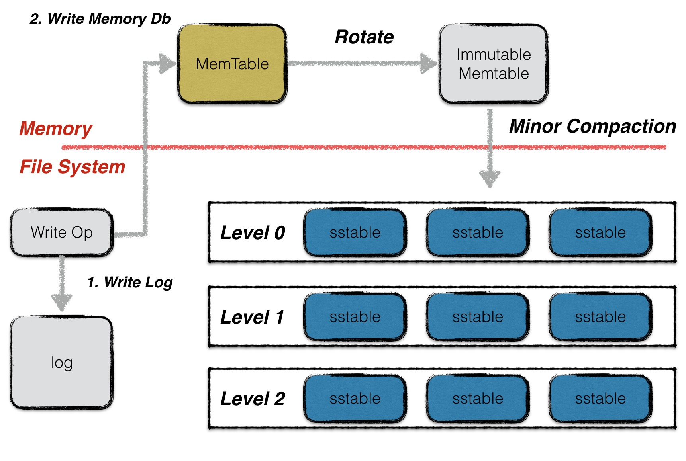

# leveldb

### 概述

leveldb是一个写性能十分优秀的存储引擎，是典型的LSM树(Log Structured-Merge Tree)实现。LSM树的核心思想就是放弃部分读的性能，换取最大的写入能力。 详细解说见[leveldb-handbook](https://leveldb-handbook.readthedocs.io/zh/latest/index.html)

* 整体架构如图
  

### sstable

* 每个sstable将数据拆分成多个datablock（每个block大小不超过4KB）。当在sstable中查询某个key时，分下面几步:
  * 查询filterblock, 判断key是否在该sstable中。
  * 对每个indexBlock进行二分查找，查到datablock的位置。
  * 对与所在的datablock进行二分查找，查找得到对应的key-value
    * block 内查找方式： block将每k个key进行前缀压缩（k默认为16），然后记录了每段压缩块的第一个key的位置，对该位置信息进行二分查找，然后顺序（解压并）比较k个连续的key是否相等。 
* indexBlock在打开sstable文件时会全部读取， sstable文件句柄通过lru cache进行缓存
* filterBlock, 构建01数组，对每个key用k个hash函数映射到k个位置上，将该位值置为1。查询的时候计算key的k个hash映射位， 如果所有位均为1，代表key有可能存在于该block。 空间复杂度O(n * bits_per_key)
* bloomFilter 算法:
  对于每个key先用hash算法（如murmurhash）算出hash值，然后将该值右翻转17位(delta = val >> 17 | val <<15), k个hash函数的值就是hash[i] = val + delta * i

### compaction

> minor compaction见上面的手册地址， 这里仅讨论major compaction

* 选取一个需要进行合并的sstable
  * 选取策略：1, 0层文件数目超过上限; 2, 当level i层文件的总大小超过(10 ^ i) MB; 3,当某个文件无效读取的次数过多;
* 假设该sstable的level 为i，如果i为0，将第0层所有与其key范围重叠的sstable加入本次合并; 将i + 1层与其范围重叠的sstable加入合并; 在不扩大i + 1的文件数目范围的前提下，将i层与选中的i + 1层有重叠的sstable加入本次合并。
* 将上一步选中的sstable进行多路归并排序，输出为多个大小固定的sstable文件到i + 1层。 
* 对本次合并生成新的version， 同时清理过期version。

### Recover

* 通过manifest文件找到上次version更新时的日志文件标号，然后将这之后的数据重新Add进memtable
  
### rocksdb feature

> rocksdb 是基于leveldb实现的数据库存储引擎，实现了许多leveldb中没有的功能

#### concurrently insert

> leveldb的skiplist 仅支持单线程写入（修改），多线程读, rocksdb 为了提高写入效率实现了支持多线程插入的skiplist

* leveldb skiplist线程安全分析： 
